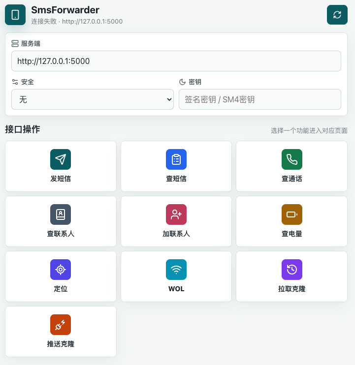

# SmsForwarder Vue

这是一个用于适配 [SmsForwarder](https://github.com/pppscn/SmsForwarder) 服务端接口的移动端前端项目。

项目基于 Vue 3 + Vite 构建，主要用于在浏览器中主动调用 SmsForwarder 手机端开启的 HTTP 服务，实现短信发送、短信查询、通话查询、联系人查询、联系人添加、电量查询、定位、WOL、克隆配置拉取与推送等操作。



## 功能

- 移动端优先的接口操作首页
- 服务端地址配置
- 支持无安全措施、签名、SM4 三种调用模式
- 按 SmsForwarder 服务端要求封装 `{ timestamp, sign?, data }` 请求结构
- 按接口类型展示响应内容，而不是直接显示原始报文
- 支持 GitHub Pages 自定义域名部署

## 使用

安装依赖：

```bash
npm install
```

本地开发：

```bash
npm run dev
```

构建：

```bash
npm run build
```

## 服务端地址

在 SmsForwarder 手机端开启服务端后，在前端页面填写服务地址，例如：

```txt
http://192.168.1.8:5000
```

默认端口通常为 `5000`，具体以 SmsForwarder 服务端设置为准。

## HTTPS 注意事项

如果前端部署在 HTTPS 域名下，例如 GitHub Pages，自行访问 `http://手机IP:5000` 时可能会被浏览器拦截混合内容请求。生产环境建议使用 HTTPS 反代、内网穿透 HTTPS 地址，或在可信内网环境中使用 HTTP 页面访问。

## 关联项目

- [pppscn/SmsForwarder](https://github.com/pppscn/SmsForwarder)
